标准流程
========

.. |4b| image:: _static/_images/MJt4.png
    :width: 10 %

.. |6b| image:: _static/_images/MJt6.png
    :width: 10 %
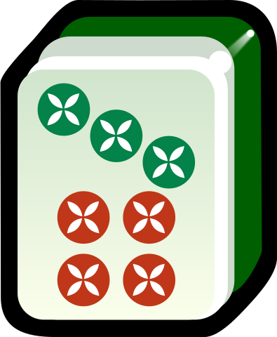
.. |8b| image:: _static/_images/MJt8.png
    :width: 10 %
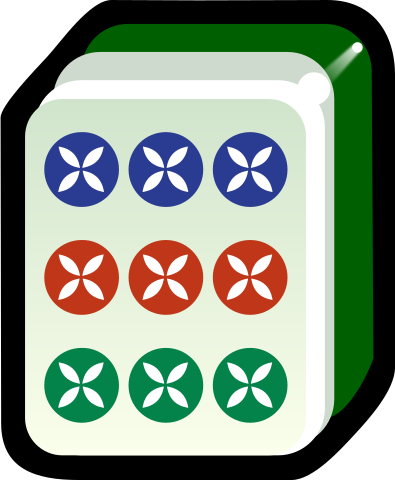

.. |2t| image:: _static/_images/MJs2.png
    :width: 10 %
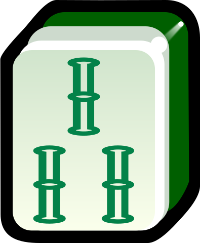
.. |4t| image:: _static/_images/MJs4.png
    :width: 10 %
.. |5t| image:: _static/_images/MJs5.png
    :width: 10 %
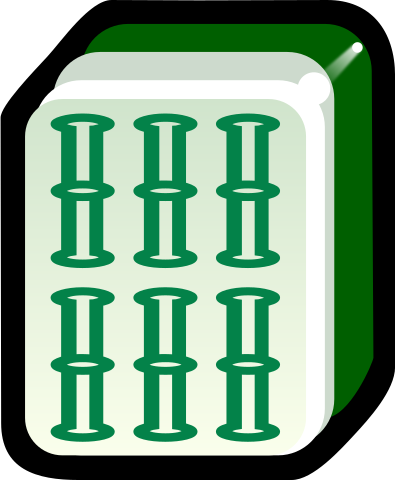
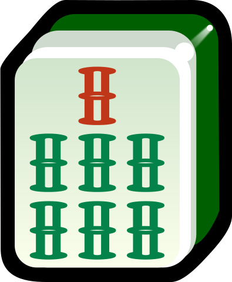
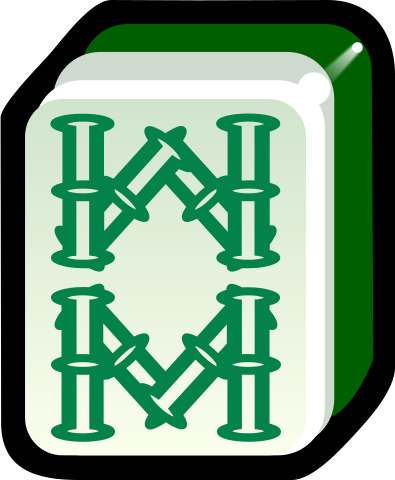
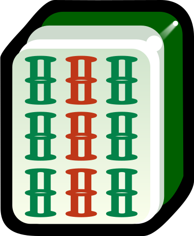
.. |1w| image:: _static/_images/MJw1.png
    :width: 10 %
.. |2w| image:: _static/_images/MJw2.png
    :width: 10 %
.. |3w| image:: _static/_images/MJw3.png
    :width: 10 %
.. |4w| image:: _static/_images/MJw4.png
    :width: 10 %
.. |5w| image:: _static/_images/MJw5.png
    :width: 10 %
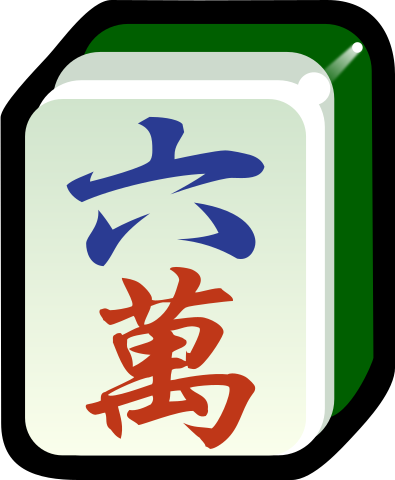
.. |7w| image:: _static/_images/MJw7.png
    :width: 10 %
.. |8w| image:: _static/_images/MJw8.png
    :width: 10 %
.. |9w| image:: _static/_images/MJw9.png
    :width: 10 %
.. |df| image:: _static/_images/MJf1.png
    :width: 10 %
.. |nf| image:: _static/_images/MJf2.png
    :width: 10 %
.. |xf| image:: _static/_images/MJf3.png
    :width: 10 %
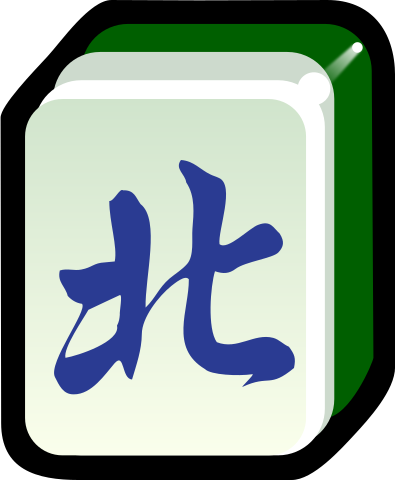
.. |zhong| image:: _static/_images/MJd1.png
    :width: 10 %
.. |fa| image:: _static/_images/MJd2.png
    :width: 10 %
.. |bai| image:: _static/_images/MJd3.png
    :width: 10 %
.. |chun| image:: _static/_images/Mjh1.png
    :width: 10 %
.. |xia| image:: _static/_images/Mjh2.png
    :width: 10 %
.. |qiu| image:: _static/_images/Mjh3.png
    :width: 10 %
.. |dong| image:: _static/_images/Mjh4.png
    :width: 10 %
.. |mei| image:: _static/_images/Mjh5.png
    :width: 10 %
.. |lan| image:: _static/_images/Mjh6.png
    :width: 10 %
.. |ju| image:: _static/_images/Mjh7.png
    :width: 10 %
.. |zhu| image:: _static/_images/Mjh8.png
    :width: 10 %

.. _认识麻将牌:

1 认识麻将牌
--------------------
* 数牌

   * 饼/筒
      |1b| |2b| |3b| |4b| |5b| |6b| |7b| |8b| |9b|
   * 条/索
      |1t| |2t| |3t| |4t| |5t| |6t| |7t| |8t| |9t|
   * 万
      |1w| |2w| |3w| |4w| |5w| |6w| |7w| |8w| |9w|
* 字牌

   * 风/四喜
      |df| |nf| |xf| |bf|
   * 箭/三元
      |zhong| |fa| |bai|
* 花牌

   * 君子
      |chun| |xia| |qiu| |dong|
   * 四季
      |mei| |lan| |ju| |zhu|

以上麻将牌，每种各四张。

2 上桌
--------

.. _Mahjong_table:
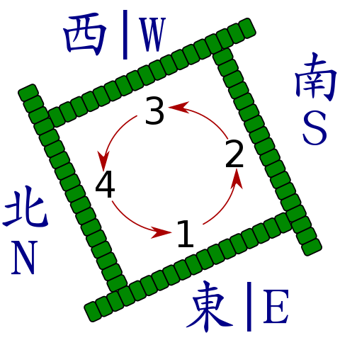
    
   麻将桌

庄坐在东的位置（但绝大多数除正规比赛外的情况外，大家随便坐下就不再换位置了）。庄通常代表先抓牌的人，一般按逆时针方向轮流坐庄或赢者坐庄。最开始可以通过掷骰子比最大来决定谁最先坐庄。

3 洗牌码牌
----------
* 以只去掉 :ref:`花牌 <认识麻将牌>` 的打法为例。:ref:`数牌 <认识麻将牌>` 和 :ref:`字牌 <认识麻将牌>` 共 136 张。
* 将麻将牌洗乱。
* 按 :ref:`Mahjong_table` 所示，每人面前码 17 墩牌（一墩为上下两张）。注意右侧稍向桌内倾斜，方便抓牌。如果你的玩法不为只包含数牌和风牌的 136 张情况，请参考 :doc:`/stacking`。

4 掷骰子
--------
* 由庄家掷两枚骰子，点数和为 :math:`x`。
* 庄家为 1，**逆时针** 方向数到第 :math:`x` 家，将这家记为 :math:`A`。
* 由 :math:`A` 再掷两枚骰子，点数和为 :math:`y`。
* 看 :math:`A` 面前的牌墩 **顺时针** 数过 :math:`z=x+y` 墩，这决定了从哪里开始抓麻将牌
* 如果你认为你的玩法不是这样掷骰子或数牌，请参考 :doc:`/throwing`。
* 根据骰子点数快速计算 :math:`A` 的位置以及根据骰子点数和快速计算数过 :math:`z` 墩牌的口诀，清参考 :doc:`/throwing`。

5 抓牌
------
* 由庄家开始，按 **逆时针** 方向，每人抓一手（两墩）。这里要注意：第一，庄家抓的是 :math:`A` 面前顺时针跳过 `z` 墩牌后，第 :math:`(z+1,z+2)` 这一手（两墩）。
* 连续抓三圈。每人手里有 3 手（6 墩，12 张）牌
* 之后每人再按顺序抓一张，共 13 张牌。
* **注意**，除了麻将牌在顺时针被抓走外，一切都是逆时针进行。（**原因，可跳过**：麻将牌之所以被顺时针抓走，很可能是因为与扑克牌类似。抓扑克牌前，负责洗牌的人通常会用右手将洗好的扑克牌从左往右摊开，这样导致右边的扑克牌在上，左边的扑克牌在下。当扑克牌被一张一张抓走时，牌从右向左逐渐减少。对于麻将牌来说，从右向左逐渐减少就是顺时针方向被抓走。）
* 由于之后开始玩牌时，大家都是抓一张打一张。所以最开始是庄家抓一张打一张。因此，庄家会在抓第 13 张牌的同时，把游戏开始时抓的第一张牌（第 14 张）一起抓来，称为 :ref:`jump_draw` 。这样一来，游戏开始后，庄家不用抓牌，直接打出一张牌即可。

.. _jump_draw:
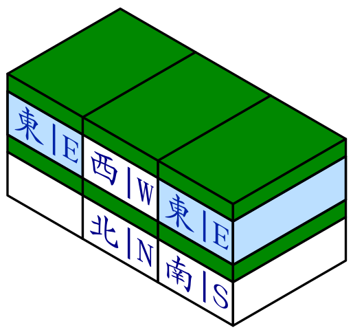

   跳牌

6 目标
------
* 基本流程为逆时针方向每人抓一张，再打出去一张。
* 目标：最先把手中的牌构造成和 (hú) 牌形式。和牌形式包括基本和牌形式和特殊和牌形式，具体请参考 :doc:`win`。

6.1 牌型
^^^^^^^^
* 刻子：形如 AAA，如
   |3t| |3t| |3t|，|df| |df| |df|
* 杠：形如 AAAA，如
   |5t| |5t| |5t| |5t|，|zhong| |zhong| |zhong| |zhong|
   
   其功能和刻子一样
* 顺子：形如 BCD 的 :ref:`数牌 <认识麻将牌>`，如
   |2t| |3t| |4t|，|7w| |8w| |9w|
* 面子：包括顺子和刻子（包含杠）
* 将（对子、一对儿将）：形如 EE，如
   |1w| |1w|，|fa| |fa|

6.2 基本和牌形式
^^^^^^^^^^^^^^^^
将牌型构造成 4 个面子 + 1 对将，即 4 * (AAA 或 AAAA 或 BCD) + EE，如

.. image:: _static/_images/MJs2.png
    :width: 6 %

.. image:: _static/_images/MJw5.png
    :width: 6 %

.. image:: _static/_images/MJw7.png
    :width: 6 %
.. image:: _static/_images/MJf1.png
    :width: 6 %
.. image:: _static/_images/MJf1.png
    :width: 6 %
.. image:: _static/_images/MJf1.png
    :width: 6 %
.. image:: _static/_images/MJw9.png
    :width: 6 %
.. image:: _static/_images/MJw9.png
    :width: 6 %