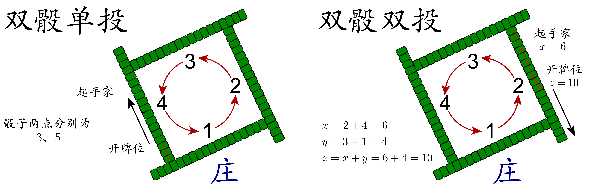

掷骰子与抓牌
============

掷骰子的目的有二，一是决定 **起手家**，二是决定 **开牌位**。下面简述双骰子情况下的两种常用规则。

    
   双骰单投与双骰双投
   
* **双骰单投**：投出的两骰子点数和决定起手家，较小的点数决定开牌位。
* **双骰双投**：第一次投出的两骰子点数和 :math:`x` 决定起手家，第二次投出的两骰子的点数和为 :math:`y`，:math:`z=x+y` 决定开牌位。

口诀
----

算起手家口诀
^^^^^^^^^^^^
* 2 过一
* 3 对川
* 4 到底
* 5 自手
* 6 过一
* 7 对川
* 8 到底
* 9 自手
* 10 过一
* 11 对川
* 12 到底

总结：

* 5、9 自手（自己）
* 2、6、10 过一（下家，右手）
* 3、7、11 对川（对家）
* 4、8、12 到底（上家，左手）

算开牌位置口诀
^^^^^^^^^^^^^^

当每家面前有 17 墩牌时：

* 9 一人一手/家家有
* 10 三把剩一
* 11 三手齐
* 12 两把剩一
* 13 两把抓干
* 14 抓把剩一
* 15 顶头数
* 16 两头凑
* 19 过一手