和牌牌型和动作
==============

.. |1b| image:: _static/images/suits/MJt1.png
    :width: 4 %
.. |2b| image:: _static/images/suits/MJt2.png
    :width: 4 %
.. |3b| image:: _static/images/suits/MJt3.png
    :width: 4 %
.. |4b| image:: _static/images/suits/MJt4.png
    :width: 4 %
.. |5b| image:: _static/images/suits/MJt5.png
    :width: 4 %
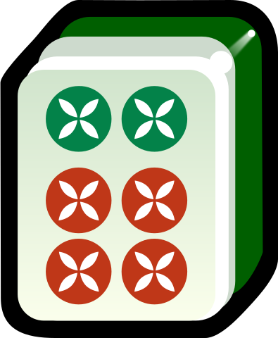
.. |7b| image:: _static/images/suits/MJt7.png
    :width: 4 %
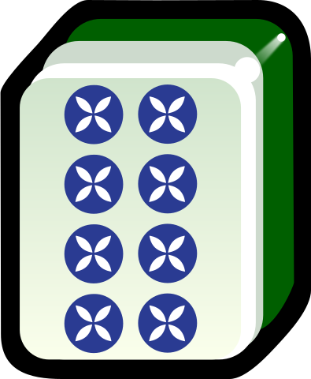
.. |9b| image:: _static/images/suits/MJt9.png
    :width: 4 %
.. |1t| image:: _static/images/suits/MJs1.png
    :width: 4 %
.. |2t| image:: _static/images/suits/MJs2.png
    :width: 4 %
.. |3t| image:: _static/images/suits/MJs3.png
    :width: 4 %
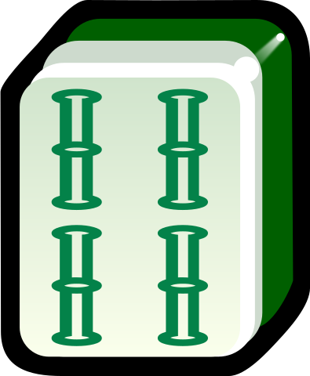
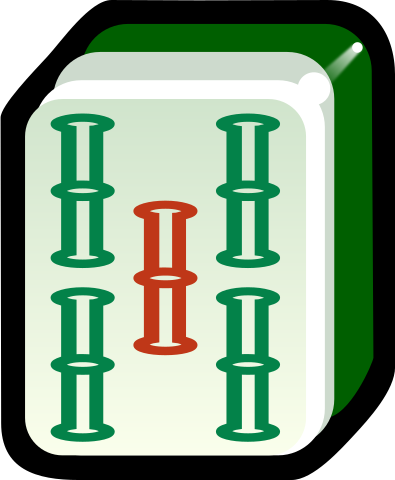
.. |6t| image:: _static/images/suits/MJs6.png
    :width: 4 %
.. |7t| image:: _static/images/suits/MJs7.png
    :width: 4 %
.. |8t| image:: _static/images/suits/MJs8.png
    :width: 4 %
.. |9t| image:: _static/images/suits/MJs9.png
    :width: 4 %
.. |1w| image:: _static/images/suits/MJw1.png
    :width: 4 %
.. |2w| image:: _static/images/suits/MJw2.png
    :width: 4 %
.. |3w| image:: _static/images/suits/MJw3.png
    :width: 4 %
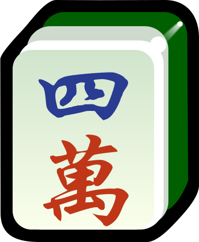
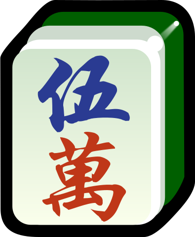
.. |6w| image:: _static/images/suits/MJw6.png
    :width: 4 %
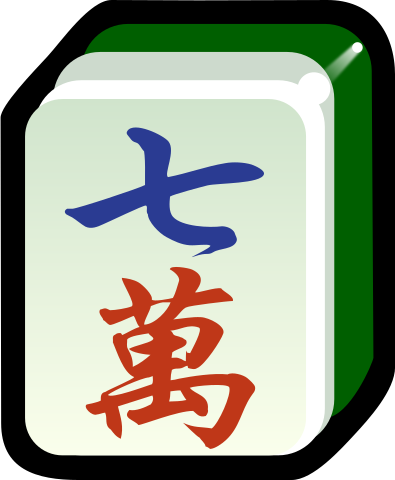
.. |8w| image:: _static/images/suits/MJw8.png
    :width: 4 %
.. |9w| image:: _static/images/suits/MJw9.png
    :width: 4 %
.. |df| image:: _static/images/suits/MJf1.png
    :width: 4 %
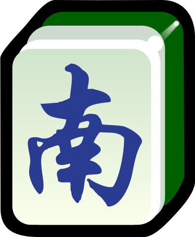
.. |xf| image:: _static/images/suits/MJf3.png
    :width: 4 %
.. |bf| image:: _static/images/suits/MJf4.png
    :width: 4 %
.. |zhong| image:: _static/images/suits/MJd1.png
    :width: 4 %
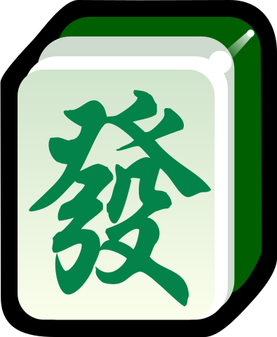
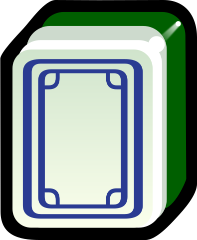
.. |chun| image:: _static/images/suits/MJh1.png
    :width: 4 %
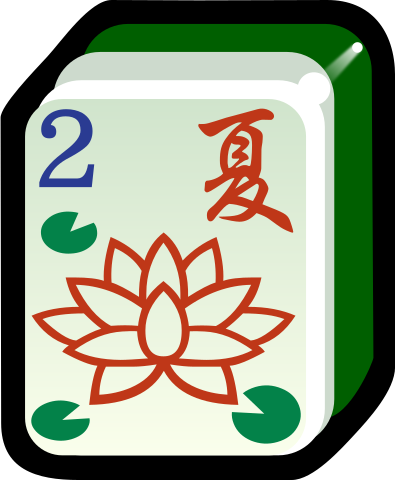
.. |qiu| image:: _static/images/suits/MJh3.png
    :width: 4 %
.. |dong| image:: _static/images/suits/MJh4.png
    :width: 4 %
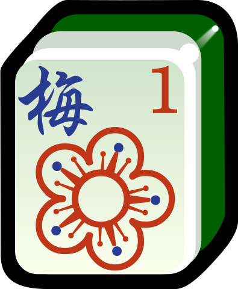
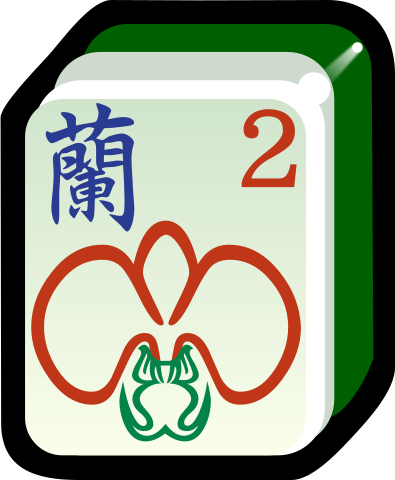
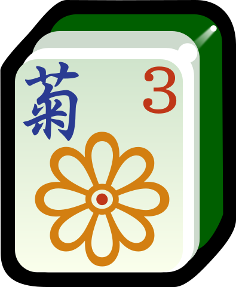
.. |zhu| image:: _static/images/suits/MJh8.png
    :width: 4 %

特殊和牌牌型
------------

本部分会尽可能全面列出各种特殊和牌牌型。注意，这里只对他们进行定义，不说明分数。是否认可某一特殊和牌牌型及其对应分数应查阅 :doc:`/variants/index`。

* **七对**：七对将，AA BB CC DD EE FF GG。如

  |df| |df| :math:`\ ` |nf| |nf| :math:`\ ` |xf| |xf| :math:`\ ` |bf| |bf| :math:`\ ` |1t| |1t| :math:`\ ` |9t| |9t| :math:`\ ` |4w| |4w|

  * **龙七对（豪华七对）**：AA AA BB CC DD EE FF。注意，AA AA 不能开杠。如
    
    |df| |df| :math:`\ ` |df| |df| :math:`\ ` |nf| |nf| :math:`\ ` |xf| |xf| :math:`\ ` |1t| |1t| :math:`\ ` |9t| |9t| :math:`\ ` |4w| |4w|

    * **双龙七对（超豪华七对）**：AA AA BB BB CC DD EE。注意，AA AA 不能开杠，BB BB 不能开杠。如

      |df| |df| :math:`\ ` |df| |df| :math:`\ ` |1t| |1t| :math:`\ ` |1t| |1t| :math:`\ ` |xf| |xf| :math:`\ ` |9t| |9t| :math:`\ ` |4w| |4w|

      * **三龙七对（超超豪华七对）**：AA AA BB BB CC CC DD。注意，AA AA 不能开杠，BB BB 不能开杠，CC CC 不能开杠。如

        |df| |df| :math:`\ ` |df| |df| :math:`\ ` |1t| |1t| :math:`\ ` |1t| |1t| :math:`\ ` |9t| |9t| :math:`\ ` |9t| |9t| :math:`\ ` |4w| |4w|

* **混一色**：只包含一种数牌和字牌，数字牌和字牌必须都有，因此。如

  |1w| |2w| |3w| :math:`\ ` |nf| |nf| |nf| :math:`\ ` |4w| |5w| |6w| :math:`\ ` |9w| |9w| |9w| :math:`\ ` |zhong| |zhong|

  * **绿一色**：所有牌都是绿的（包括 2、3、4、6、8 条和发财）。如
  
    |2t| |3t| |4t| :math:`\ ` |2t| |3t| |4t| :math:`\ ` |6t| |6t| |6t| :math:`\ ` |8t| |8t| |8t| :math:`\ ` |fa| |fa|

  * **清一色**：只有一种花色（全饼 或 全条 或 全万 或 全字（包含风和箭）。如

    |2b| |2b| |2b| :math:`\ ` |3b| |4b| |5b| :math:`\ ` |6b| |7b| |8b| :math:`\ ` |7b| |8b| |9b| :math:`\ ` |5b| |5b|

    * **九宝莲灯**：某种颜色的 111234678999，再加其中任何一张。注意，可能对听牌、门清等有要求。如
  
      |1w| |1w| |1w| :math:`\ ` |2w| |3w| |4w| :math:`\ ` |5w| |5w| :math:`\ ` |6w| |7w| |8w| :math:`\ ` |9w| |9w| |9w|

    * **字一色**：只有字牌（包含风和箭）。注意，**字一色** 也可归为 **对对和-混幺九-字一色**。如

      |zhong| |zhong| |zhong| :math:`\ ` |fa| |fa| |fa| :math:`\ ` |df| |df| |df| :math:`\ ` |xf| |xf| |xf| :math:`\ ` |nf| |nf|

  * **大四喜**：包含东、南、西、北四个都是刻子或杠。注意，**大四喜** 也可归为 **对对和-大四喜**。如

    |df| |df| |df| :math:`\ ` |nf| |nf| |nf| :math:`\ ` |xf| |xf| |xf| :math:`\ ` |bf| |bf| |bf| :math:`\ ` |2b| |2b|

  * **小四喜**：东、南、西、北四个中其中三个是刻子或杠，另一个是一对将。如
  
    |df| |df| |df| :math:`\ ` |nf| |nf| |nf| :math:`\ ` |xf| |xf| |xf| :math:`\ ` |5w| |6w| |7w| :math:`\ ` |bf| |bf|

* **对对和/碰碰和/大对子**：四个面子全是刻子或杠 4 * (AAA 或 AAAA) + BB。如

  |1t| |1t| |1t| :math:`\ ` |4b| |4b| |4b| :math:`\ ` |6t| |6t| |6t| :math:`\ ` |bai| |bai| |bai| :math:`\ ` |9b| |9b|

  * **四暗刻**：四个面子全是刻子且都不是碰出来的。

  * **十八罗汉**：四个面子全是杠。如

    |1t| |1t| |1t| |1t| :math:`\ ` |4b| |4b| |4b| |4b| :math:`\ ` |6t| |6t| |6t| |6t| :math:`\ ` |bai| |bai| |bai| |bai| :math:`\ ` |9b| |9b|

  * **大四喜**：包含东、南、西、北四个都是刻子或杠。注意，**大四喜** 也可归为 **混一色-大四喜**。如

    |df| |df| |df| :math:`\ ` |nf| |nf| |nf| :math:`\ ` |xf| |xf| |xf| :math:`\ ` |bf| |bf| |bf| :math:`\ ` |2b| |2b|

  * **混幺九**：只包含 1、9 和字牌。殊情况。如
  
    |1w| |1w| |1w| :math:`\ ` |1t| |1t| |1t| :math:`\ ` |9t| |9t| |9t| :math:`\ ` |df| |df| |df| :math:`\ ` |1b| |1b|

    * **幺九**：只包含 1 和 9。如
    
      |1w| |1w| |1w| :math:`\ ` |1t| |1t| |1t| :math:`\ ` |9t| |9t| |9t| :math:`\ ` |9w| |9w| |9w| :math:`\ ` |1b| |1b|

    * **字一色**：只有字牌（包含风和箭）。注意，**字一色** 也可归为 **混一色-清一色-字一色**。如

      |zhong| |zhong| |zhong| :math:`\ ` |fa| |fa| |fa| :math:`\ ` |df| |df| |df| :math:`\ ` |xf| |xf| |xf| :math:`\ ` |nf| |nf|

* **一条龙**：包含同一花色的 123 456 789。如

  |1t| |2t| |3t| :math:`\ ` |4t| |5t| |6t| :math:`\ ` |7t| |8t| |9t| :math:`\ ` |2w| |2w| |2w| :math:`\ ` |bai| |bai|

* **十三幺**：所有幺张各一张，其中有一个幺张是一对将。（**幺张** 就是指 1、9 和字牌。）注意，尽管 **十三幺** 是 **混幺九**，但由于其极特殊，不是基本和牌牌型，所以几乎和其它特殊和牌牌型全部冲突，所以 **十三幺** 出现时 **一般** 不重复计算为 **混幺九**。如

  |df| |xf| |nf| |bf| :math:`\ ` |zhong| |fa| |bai| :math:`\ ` |1b| |9b| :math:`\ ` |1t| |9t| :math:`\ ` |1w| |9w| :math:`\ ` |9w|

* **大三元**：中、发、白三个都是刻子或杠。如

  |zhong| |zhong| |zhong| :math:`\ ` |fa| |fa| |fa| :math:`\ ` |bai| |bai| |bai| :math:`\ ` |2t| |3t| |4t| :math:`\ ` |7w| |7w|

* **小三元**：中、发、白，其中两个是刻子或杠，一个是一对将。如

  |zhong| |zhong| |zhong| :math:`\ ` |fa| |fa| |fa| :math:`\ ` |6t| |7t| |8t| :math:`\ ` |8b| |8b| |8b| :math:`\ `  |bai| |bai|
  

和牌动作
--------
* 对倒：手里有 AA 和 BB，和 A 或 B。
* 两面搭子：手里有 BC，和 A 或 D。
* 砍（卡）张：手里有 AC，和 B。
* 边张：手里有 12 和 3 或手里有 89 和 7。
* 单钓：手里已经有四副面子了，有一个单张等相同的一张凑一对将。

特殊和牌动作
^^^^^^^^^^^^
* 天和：庄家最开始手里的十四张牌正好是和牌牌型。
* 地和：庄家第一轮打出全局的第一张牌时，有人和牌。如果非庄家最开始摸上来的十三张牌已经构成听牌牌型，称为 **天听**。
* 海底捞：牌墩的最后一张抓上来，自摸和牌。
* 海底炮：牌墩的最后一张抓上来后，打出去一张（可能要求必须是抓到的最后一张）后点炮导致有人和牌。（注意，有些地方的规则，牌墩最后一张牌抓上来不出手，也就是不再打出去了。）
* 杠开（杠上开花）：开杠后抓上来的那一张刚好自摸和牌。
* 杠上炮：开杠后抓上来一张，打出去一张（可能要求必须是刚刚开杠抓的那一张）后点炮导致有人和牌。
