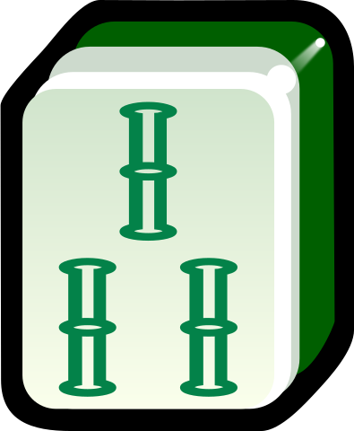
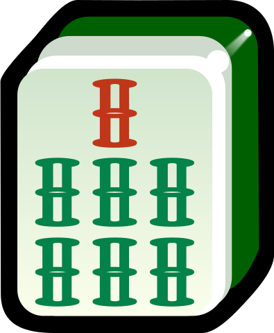

和牌牌型和动作
========

.. |1b| image:: _static/images/MJt1.png
    :width: 3 %
.. |2b| image:: _static/images/MJt2.png
    :width: 3 %
.. |3b| image:: _static/images/MJt3.png
    :width: 3 %
.. |4b| image:: _static/images/MJt4.png
    :width: 3 %
.. |5b| image:: _static/images/MJt5.png
    :width: 3 %
.. |6b| image:: _static/images/MJt6.png
    :width: 3 %
.. |7b| image:: _static/images/MJt7.png
    :width: 3 %
.. |8b| image:: _static/images/MJt8.png
    :width: 3 %
.. |9b| image:: _static/images/MJt9.png
    :width: 3 %
.. |1t| image:: _static/images/MJs1.png
    :width: 3 %

.. |4t| image:: _static/images/MJs4.png
    :width: 3 %
.. |5t| image:: _static/images/MJs5.png
    :width: 3 %
.. |6t| image:: _static/images/MJs6.png
    :width: 3 %

.. |8t| image:: _static/images/MJs8.png
    :width: 3 %
.. |9t| image:: _static/images/MJs9.png
    :width: 3 %
.. |1w| image:: _static/images/MJw1.png
    :width: 3 %
.. |2w| image:: _static/images/MJw2.png
    :width: 3 %

.. |4w| image:: _static/images/MJw4.png
    :width: 3 %
.. |5w| image:: _static/images/MJw5.png
    :width: 3 %
.. |6w| image:: _static/images/MJw6.png
    :width: 3 %

.. |8w| image:: _static/images/MJw8.png
    :width: 3 %
.. |9w| image:: _static/images/MJw9.png
    :width: 3 %
.. |df| image:: _static/images/MJf1.png
    :width: 3 %
.. |nf| image:: _static/images/MJf2.png
    :width: 3 %
.. |xf| image:: _static/images/MJf3.png
    :width: 3 %
.. |bf| image:: _static/images/MJf4.png
    :width: 3 %
.. |zhong| image:: _static/images/MJd1.png
    :width: 3 %
.. |fa| image:: _static/images/MJd2.png
    :width: 3 %
.. |bai| image:: _static/images/MJd3.png
    :width: 3 %
.. |chun| image:: _static/images/MJh1.png
    :width: 3 %
.. |xia| image:: _static/images/MJh2.png
    :width: 3 %
.. |qiu| image:: _static/images/MJh3.png
    :width: 3 %
.. |dong| image:: _static/images/MJh4.png
    :width: 3 %

.. |ju| image:: _static/images/MJh7.png
    :width: 3 %
.. |zhu| image:: _static/images/MJh8.png
    :width: 3 %

特殊和牌牌型
------------
本部分会尽可能全面列出各种特殊和牌牌型。注意，这里只对他们进行定义，不说明分数。是否认可某一特殊和牌牌型及其对应分数应查阅 :doc:`/variants'。

* **七对**：七对将，AA BB CC DD EE FF GG。如
   |df| |df| - |nf| |nf| - |xf| |xf| - |bf| |bf| - |1t| |1t| - |9t| |9t| - |4w| |4w|

   * **龙七对（豪华七对）**：AA AA BB CC DD EE FF。注意，AA AA 不能开杠。如
      |df| |df| - |df| |df| - |nf| |nf| - |xf| |xf| - |1t| |1t| - |9t| |9t| - |4w| |4w|

      * **双龙七对（超豪华七对）**：AA AA BB BB CC DD EE。注意，AA AA 不能开杠，BB BB 不能开杠。如
         |df| |df| - |df| |df| - |1t| |1t| - |1t| |1t| - |xf| |xf| - |9t| |9t| - |4w| |4w|

         * **三龙七对（超超豪华七对）**：AA AA BB BB CC CC DD。注意，AA AA 不能开杠，BB BB 不能开杠，CC CC 不能开杠。如
            |df| |df| - |df| |df| - |1t| |1t| - |1t| |1t| - |9t| |9t| - |9t| |9t| - |4w| |4w|
* **对对和/碰碰和/大对子**：四个面子全是刻子或杠 4 * (AAA 或 AAAA) + BB。如
   |1t| |1t| |1t| - |4b| |4b| |4b| - |6t| |6t| |6t| - |bai| |bai| |bai| - |9b| |9b|

和牌动作
--------
* 对倒
* 砍张

特殊和牌动作
^^^^^^^^^^^^
* 天和
* 地和
