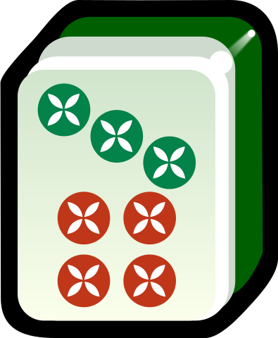
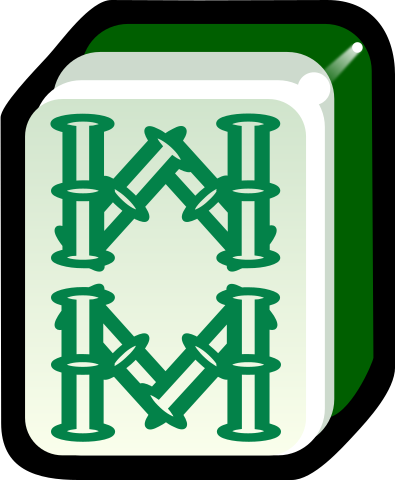
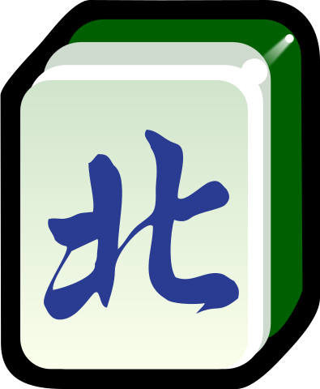

和牌牌型和动作
========

.. |1b| image:: _static/images/MJt1.png
    :width: 4 %

.. |3b| image:: _static/images/MJt3.png
    :width: 4 %

.. |5b| image:: _static/images/MJt5.png
    :width: 4 %

.. |8b| image:: _static/images/MJt8.png
    :width: 4 %
.. |9b| image:: _static/images/MJt9.png
    :width: 4 %
.. |1t| image:: _static/images/MJs1.png
    :width: 4 %
.. |2t| image:: _static/images/MJs2.png
    :width: 4 %
.. |3t| image:: _static/images/MJs3.png
    :width: 4 %
.. |4t| image:: _static/images/MJs4.png
    :width: 4 %

.. |6t| image:: _static/images/MJs6.png
    :width: 4 %
.. |7t| image:: _static/images/MJs7.png
    :width: 4 %

.. |9t| image:: _static/images/MJs9.png
    :width: 4 %
.. |1w| image:: _static/images/MJw1.png
    :width: 4 %
.. |2w| image:: _static/images/MJw2.png
    :width: 4 %
.. |3w| image:: _static/images/MJw3.png
    :width: 4 %

.. |5w| image:: _static/images/MJw5.png
    :width: 4 %
.. |6w| image:: _static/images/MJw6.png
    :width: 4 %
.. |7w| image:: _static/images/MJw7.png
    :width: 4 %
.. |8w| image:: _static/images/MJw8.png
    :width: 4 %

.. |df| image:: _static/images/MJf1.png
    :width: 4 %

.. |xf| image:: _static/images/MJf3.png
    :width: 4 %

.. |zhong| image:: _static/images/MJd1.png
    :width: 4 %
.. |fa| image:: _static/images/MJd2.png
    :width: 4 %

.. |chun| image:: _static/images/MJh1.png
    :width: 4 %

.. |dong| image:: _static/images/MJh4.png
    :width: 4 %
.. |mei| image:: _static/images/MJh5.png
    :width: 4 %
.. |lan| image:: _static/images/MJh6.png
    :width: 4 %
.. |ju| image:: _static/images/MJh7.png
    :width: 4 %
.. |zhu| image:: _static/images/MJh8.png
    :width: 4 %

特殊和牌牌型
------------
本部分会尽可能全面列出各种特殊和牌牌型。注意，这里只对他们进行定义，不说明分数。是否认可某一特殊和牌牌型及其对应分数应查阅 :doc:`/variants'。

* **七对**：七对将，AA BB CC DD EE FF GG。如

  |df| |df| :math:`\ ` |nf| |nf| :math:`\ ` |xf| |xf| :math:`\ ` |bf| |bf| :math:`\ ` |1t| |1t| :math:`\ ` |9t| |9t| :math:`\ ` |4w| |4w|

  * **龙七对（豪华七对）**：AA AA BB CC DD EE FF。注意，AA AA 不能开杠。如
    
    |df| |df| :math:`\ ` |df| |df| :math:`\ ` |nf| |nf| :math:`\ ` |xf| |xf| :math:`\ ` |1t| |1t| :math:`\ ` |9t| |9t| :math:`\ ` |4w| |4w|

    * **双龙七对（超豪华七对）**：AA AA BB BB CC DD EE。注意，AA AA 不能开杠，BB BB 不能开杠。如

      |df| |df| :math:`\ ` |df| |df| :math:`\ ` |1t| |1t| :math:`\ ` |1t| |1t| :math:`\ ` |xf| |xf| :math:`\ ` |9t| |9t| :math:`\ ` |4w| |4w|

      * **三龙七对（超超豪华七对）**：AA AA BB BB CC CC DD。注意，AA AA 不能开杠，BB BB 不能开杠，CC CC 不能开杠。如

        |df| |df| :math:`\ ` |df| |df| :math:`\ ` |1t| |1t| :math:`\ ` |1t| |1t| :math:`\ ` |9t| |9t| :math:`\ ` |9t| |9t| :math:`\ ` |4w| |4w|

* **对对和/碰碰和/大对子**：四个面子全是刻子或杠 4 * (AAA 或 AAAA) + BB。如

  |1t| |1t| |1t| :math:`\ ` |4b| |4b| |4b| :math:`\ ` |6t| |6t| |6t| :math:`\ ` |bai| |bai| |bai| :math:`\ ` |9b| |9b|

* **一条龙**：包含同一花色的 123 456 789。如

  |1t| |2t| |3t| :math:`\ ` |4t| |5t| |6t| :math:`\ ` |7t| |8t| |9t| :math:`\ ` |2w| |2w| |2w| :math:`\ ` |bai| |bai|

* **清一色**：只有一种花色（全饼 或 全条 或 全万 或 全字（包含风和箭）。如

  ｜2b| |2b| |2b| :math:`\ ` |3b| |4b| |5b| :math:`\ ` |6b| |7b| |8b| :math:`\ ` |7b| |8b| |9b| :math:`\ ` |5b| |5b|

  * **字一色**：只有字牌（包含风和箭）。注意，一般认为 **字一色** 是 **清一色** 的特殊情况，而非 **对对和** 的特殊情况。因此如果视为 **字一色**，则 **可能** 要排除 **对对和**。如

    |zhong| |zhong| |zhong| :math:`\ ` |fa| |fa| |fa| :math:`\ ` |dong| |dong| |dong| :math:`\ ` 

* **混一色**：只包含一种数牌和字牌。如

  |1w| |2w| |3w| :math:`\ ` |nan| |nan| |nan| :math:`\ ` |4w| |5w| |6w| :math:`\ ` |9w| |9w| |9w| :math:`\ ` |zhong| |zhong|

* **混幺九**：只包含 1、9 和字牌。如

   

和牌动作
--------
* 对倒
* 砍张

特殊和牌动作
^^^^^^^^^^^^
* 天和
* 地和
